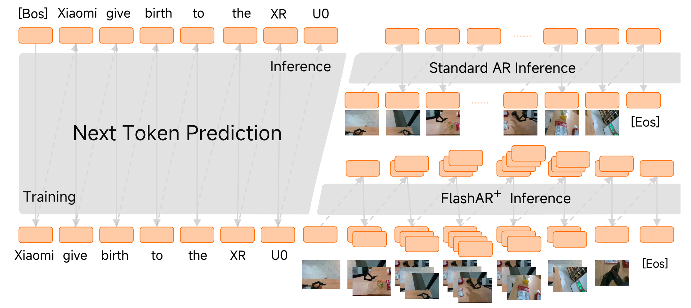

<div align="center">
<h1>Xiaomi-Robotics-U0: Unified Embodied Synthesis with World Foundation Models</h1>
<p>
Xiaomi Robotics
</p>
<p>
<a href="https://arxiv.org/abs/2607.11643"></a>
<a href="https://robotics.xiaomi.com/xiaomi-robotics-u0.html"></a>
<a href="https://huggingface.co/collections/XiaomiRobotics/xiaomi-robotics-u0"></a>
<a href="https://modelscope.cn/collections/XiaomiRobotics/Xiaomi-Robotics-U0"></a>
<a href="https://github.com/XiaomiRobotics/Xiaomi-Robotics-U0/blob/main/LICENSE"></a>
</p>
</div>

<div align="center">

</div>

|  | **Highlight** | **Summary** |
| :-: | :-- | :-- |
| 🧠 | **World Foundation Model** | A 38B autoregressive model for text, images, and embodied observations, initialized from EMU3.5. |
| 🧩 | **Unified Token Space** | Uses a shared discrete visual tokenizer and a single next-token objective across multimodal sequences. |
| 🤖 | **Embodied Synthesis** | Bridges foundation image generation with robot-centric scene, transfer, and video generation. |
| ⚡ | **Xiaomi-Robotics-U0-FlashAR Acceleration** | Decodes visual tokens in anti-diagonal groups and supports vLLM batching for high-resolution inference. |
| 📦 | **Open Inference Repo** | Provides inference code, composable configs, Gradio entry points, and AR / FlashAR vLLM patch sets. |
| 📈 | **1024x1024 T2I Speed** | On one H20, FlashAR vLLM reaches 5.44 s/img, 82.86x faster than AR eager and 3.04x faster than FlashAR eager. |

<div align="center">

</div>

Xiaomi-Robotics-U0 exposes five public task types through one autoregressive framework:

|  | **Task** | **Input → Output** |
| :-: | :-- | :-- |
| 🎨 | **T2I** | Text prompt → image. |
| 🖼️ | **X2I** | Reference image plus instruction → generated or edited image. |
| 🧭 | **Scene Gen** | Scene and task description → multi-view embodied observations. |
| 🔁 | **Transfer** | Conditioned embodied observation → target RGB multi-view scene. |
| 🎬 | **Video Gen** | Initial observation and task context → embodied video rollout. |

## News

- [July 2026] 🎉 Released the Technical Report.
- [July 2026] 🔥 Released Xiaomi-Robotics-U0 and Xiaomi-Robotics-U0-FlashAR weights.
- [July 2026] 💻 Inference code and scripts are now live!

## Table of Contents

1. [Model & Weights](#1-model--weights)
2. [Quick Start](#2-quick-start)
3. [Gradio Demo](#3-gradio-demo)
4. [Citation](#4-citation)

## 1. Model & Weights

The currently released model weights support `Scene Gen`, `Transfer`, `T2I`, and `X2I`.

| Model name | Hugging Face Weight | ModelScope Weight |
| ---------- | ------------------- | ----------------- |
| Xiaomi-Robotics-U0 | [](https://huggingface.co/XiaomiRobotics/Xiaomi-Robotics-U0) | [](https://modelscope.cn/models/XiaomiRobotics/Xiaomi-Robotics-U0) |
| Xiaomi-Robotics-U0-FlashAR | [](https://huggingface.co/XiaomiRobotics/Xiaomi-Robotics-U0-FlashAR) | [](https://modelscope.cn/models/XiaomiRobotics/Xiaomi-Robotics-U0-FlashAR) |
| VisionTokenizer | [](https://huggingface.co/BAAI/Emu3.5-VisionTokenizer/) | [](https://modelscope.cn/models/BAAI/Emu3.5-VisionTokenizer) |

The `Xiaomi-Robotics-U0-Video` checkpoint is coming soon.

## 2. Quick Start

### Environment Setup

Create one conda environment for the backend you plan to run:

| Use case | Conda environment | Notes |
| -------- | ----------------- | ----- |
| Eager inference | `xr-u0-eager` | Works for both `--engine ar` and `--engine flashar`. |
| AR vLLM inference | `xr-u0-ar-vllm` | Applies the AR vLLM patch set. |
| FlashAR vLLM inference | `xr-u0-flashar-vllm` | Applies the FlashAR vLLM patch set for speed-up. |

```bash
git clone https://github.com/XiaomiRobotics/Xiaomi-Robotics-U0.git
cd Xiaomi-Robotics-U0
```

For eager inference:

```bash
conda create -n xr-u0-eager python=3.10 -y
conda activate xr-u0-eager
pip install -U pip
pip install -r requirements-ar.txt
pip install -e .
```

For AR vLLM inference:

```bash
conda create -n xr-u0-ar-vllm python=3.12 -y
conda activate xr-u0-ar-vllm
pip install -U pip
pip install -r requirements-vllm.txt
pip install -e .
python -m xr_u0_ar.apply_vllm_patches
```

For Xiaomi-Robotics-U0-FlashAR vLLM inference:

```bash
conda create -n xr-u0-flashar-vllm python=3.12 -y
conda activate xr-u0-flashar-vllm
pip install -U pip
pip install -r requirements-vllm.txt
pip install -e .
python -m xr_u0_flashar.apply_vllm_patches
```

Keep the AR and FlashAR vLLM patch sets in separate conda environments. The
patch scripts check that the installed vLLM version is exactly `0.11.0`.

### RGB Transfer Depth Setup (Optional)

RGB Transfer uses Depth Anything 3 (DA3) to convert RGB reference images into
inverse-depth maps before Xiaomi-Robotics-U0 inference. Install the optional DA3
dependencies in the same conda environment that will run Xiaomi-Robotics-U0:

```bash
pip install -e ".[depth]"
python -m pip install --no-deps "depth-anything-3 @ git+https://github.com/ByteDance-Seed/Depth-Anything-3.git"
```

The default DA3 model is `depth-anything/DA3-LARGE-1.1`. You can pass the Hub ID
directly, or override it with a local `DA3-LARGE-1.1` directory:

```bash
python scripts/inference.py \
  --engine flashar --backend vllm --task transfer \
  --input-image-type rgb \
  --da3-model-path depth-anything/DA3-LARGE-1.1
```

You can also download it first and pass the local directory:

```bash
huggingface-cli download depth-anything/DA3-LARGE-1.1 \
  --local-dir <local-da3-model-dir>
```

### Configuration

Xiaomi-Robotics-U0 uses composable Python config files. Values such as `model_path`,
`tokenizer_path`, and `vq_path` can be local directories or HuggingFace Hub IDs
for automatic download.

| File | What to edit |
| ---- | ------------ |
| `configs/base.py` | Model, tokenizer, and `VisionTokenizer` paths: `model_path`, `tokenizer_path`, `vq_path`. |
| `configs/tasks/*.py` | Per-task examples, prompts, CFG, shapes, and input images. |
| `configs/tasks/common.py` | Shared task helpers and common sampling parameters. |
| `configs/runtimes.py` | Eager/vLLM runtime parameters such as `max_num_seqs`, `max_num_batched_tokens`, and `gpu_memory_utilization`. |
| `configs/profiles.py` | Resource profiles. `multi-gpu` sets eager device mapping or vLLM tensor parallelism. |

CLI arguments override the config files, which is useful for quick tests:

```bash
python scripts/inference.py \
  --engine ar --backend eager --task t2i \
  --model-path <Xiaomi-Robotics-U0-HF-ID-or-local-path> \
  --tokenizer-path <Xiaomi-Robotics-U0-HF-ID-or-local-path> \
  --vq-path <VisionTokenizer-HF-ID-or-local-path> \
  --dry-run
```

Use `--dry-run` whenever you want to inspect the final composed config without
loading a model.

### Inference

All tasks use the same entry point:

```bash
python scripts/inference.py \
  --engine <ar|flashar> \
  --backend <eager|vllm> \
  --task <t2i|x2i|scene-gen|transfer>
```

Use `--engine ar` with `Xiaomi-Robotics-U0` for `T2I`, `X2I`, `Scene Gen`, and `Transfer`.
Use `--engine flashar` with `Xiaomi-Robotics-U0-FlashAR` to speed up those tasks.
The `Video Gen` code remains available through `--engine ar --task video-gen`, while
the required `Xiaomi-Robotics-U0-Video` checkpoint is coming soon.

Task examples come from `configs/tasks/*.py`. Override them from the CLI with
`--prompt` and `--reference-image` when needed. Transfer uses depth-map
references by default; RGB Transfer needs `--input-image-type rgb`; see
[RGB Transfer Depth Setup](#rgb-transfer-depth-setup).

Xiaomi-Robotics-U0-FlashAR vLLM keeps `enable_prefix_caching = False` by default.

### Distributed Inference

Set visible GPUs and select the multi-GPU profile:

```bash
CUDA_VISIBLE_DEVICES=0,1 \
python scripts/inference.py --engine flashar --backend vllm --task t2i --profile multi-gpu
```

## 3. Gradio Demo

The demo runs Xiaomi-Robotics-U0-FlashAR through a FastAPI model server and a Gradio UI. It
covers `T2I`, `X2I`, `Scene Gen`, and `Transfer`.

Use the `xr-u0-flashar-vllm` environment and install the UI dependencies:

```bash
conda activate xr-u0-flashar-vllm
pip install -e ".[demo]"
```

Set paths with environment variables or the matching server CLI arguments:

```bash
export XR_U0_FLASHAR_MODEL_DIR=<flashar-model-or-local-path>
export XR_U0_FLASHAR_TOKENIZER_DIR=<flashar-tokenizer-or-local-path>
export XR_U0_VISION_TOKENIZER_DIR=<VisionTokenizer-HF-ID-or-local-path>
# Optional; only needed when using RGB images for Transfer.
export XR_U0_DA3_MODEL_PATH=depth-anything/DA3-LARGE-1.1
```

`XR_U0_DA3_MODEL_PATH` is optional. Depth-map Transfer examples do not use it.
For RGB Transfer, first install the optional DA3 dependencies as described in
[RGB Transfer Depth Setup](#rgb-transfer-depth-setup).

Start the API server and UI in two terminals:

```bash
CUDA_VISIBLE_DEVICES=0 python demo/flashar_api_server.py --load-on-startup
# CUDA_VISIBLE_DEVICES=0,1 \
# python demo/flashar_api_server.py --load-on-startup --tensor-parallel-size 2
# export XR_U0_FLASHAR_TP=2
```

```bash
python demo/flashar_gradio_app.py --api-url http://127.0.0.1:8000
```

Open `http://127.0.0.1:7860`. Outputs are saved under
`outputs/gradio_flashar/` with neighboring audit JSON files.

## 4. Citation

If you find this work useful, please cite:

```bibtex
@misc{li2026xiaomiroboticsu0,
  title         = {{Xiaomi-Robotics-U0}: Unified Embodied Synthesis with World Foundation Model},
  author        = {Xinghang Li and Jun Guo and Qiwei Li and Long Qian and Hang Lai and Yueze Wang and Hongyu Yan and Jiahang Cao and Xi Chen and Jingen Qu and Jiaxi Song and Nan Sun and Hanye Zhao and Futeng Liu and Wanli Peng and Heyun Wang and Yunhong Wang and Caoyu Xia and Jack Zhao and Diyun Xiang and Hangjun Ye and Heng Qu and Huaping Liu and Jason Li},
  year          = {2026},
  eprint        = {2607.11643},
  archivePrefix = {arXiv},
  url           = {https://arxiv.org/abs/2607.11643}
}
```
