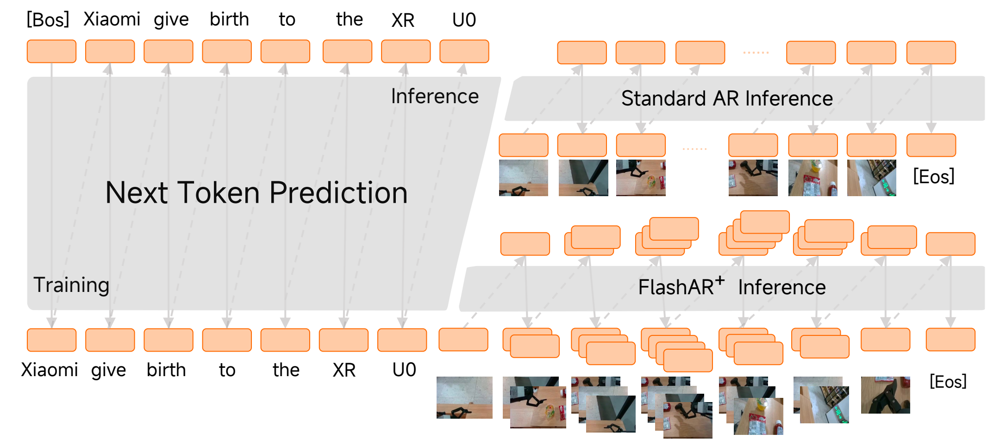
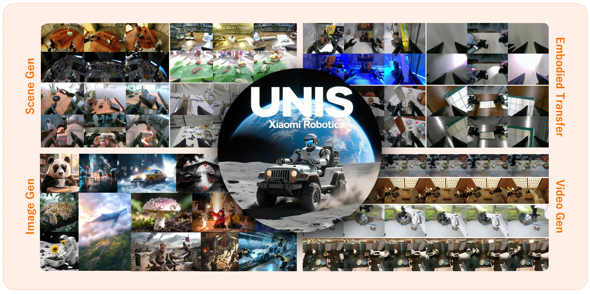

<div align="center">
<h1>Xiaomi-Robotics-U0: Unified Embodied Synthesis with World Foundation Models</h1>
<p>
Xiaomi Robotics
</p>
<p>
<a href="https://arxiv.org/abs/2607.11643"></a>
<a href="https://robotics.xiaomi.com/xiaomi-robotics-u0.html"></a>
<a href="https://huggingface.co/collections/XiaomiRobotics/xiaomi-robotics-u0"></a>
<a href="https://modelscope.cn/collections/XiaomiRobotics/Xiaomi-Robotics-U0"></a>
<a href="https://github.com/XiaomiRobotics/Xiaomi-Robotics-U0/blob/main/LICENSE"></a>
</p>
</div>

<div align="center">

</div>

|  | **Highlight** | **Summary** |
| :-: | :-- | :-- |
| 🧠 | **World Foundation Model** | A 34B autoregressive model for text, images, and embodied observations, initialized from EMU3.5. |
| 🧩 | **Unified Token Space** | Uses a shared discrete visual tokenizer and a single next-token objective across multimodal sequences. |
| 🤖 | **Embodied Synthesis** | Bridges foundation image generation with robot-centric scene, transfer, and video generation. |
| ⚡ | **Xiaomi-Robotics-U0-FlashAR Acceleration** | Decodes visual tokens in anti-diagonal groups and supports vLLM batching for high-resolution inference. |
| 📦 | **Open Inference Repo** | Provides inference code, composable configs, Gradio entry points, and AR / FlashAR vLLM patch sets. |
| 📈 | **1024x1024 T2I Speed** | On one H20, FlashAR vLLM reaches 5.44 s/img, 82.86x faster than AR eager and 3.04x faster than FlashAR eager. |

<div align="center">

</div>

Xiaomi-Robotics-U0 exposes six public task types through one autoregressive framework:

|  | **Task** | **Input → Output** |
| :-: | :-- | :-- |
| 🎨 | **T2I** | Text prompt → image. |
| 🖼️ | **X2I** | Reference image plus instruction → generated or edited image. |
| 🧭 | **Scene Gen** | Scene and task description → multi-view embodied observations. |
| 🔁 | **Transfer** | Conditioned embodied observation → target RGB multi-view scene. |
| 🦾 | **interleave_subtask** | Initial observations and task instruction → interleaved subtask text and observations. |
| 🎬 | **interleave_video** | Initial observation and task context → embodied video rollout. |

## News

- [September 2026] 🔥 Released Xiaomi-Robotics-U0-4B, Xiaomi-Robotics-U0-Sequence, and Xiaomi-Robotics-U0-4B-Sequence weights.
- [September 2026] 💻 Open-sourced the FSDP training code.
- [July 2026] 🎉 Released the Technical Report.
- [July 2026] 🔥 Released Xiaomi-Robotics-U0 and Xiaomi-Robotics-U0-FlashAR weights.
- [July 2026] 💻 Inference code and scripts are now live!

## Table of Contents

1. [Model & Weights](#model--weights)
2. [Inference](#inference)
3. [Training](#training)
4. [Citation](#citation)

## Model & Weights

`Xiaomi-Robotics-U0`, `Xiaomi-Robotics-U0-4B`, and `Xiaomi-Robotics-U0-FlashAR` support `Scene Gen`, `Transfer`, `T2I`, and `X2I`. The Sequence checkpoints support `interleave_subtask` and `interleave_video` with the eager backend.

| Model name | Hugging Face Weight | ModelScope Weight |
| ---------- | ------------------- | ----------------- |
| Xiaomi-Robotics-U0 | [](https://huggingface.co/XiaomiRobotics/Xiaomi-Robotics-U0) | [](https://modelscope.cn/models/XiaomiRobotics/Xiaomi-Robotics-U0) |
| Xiaomi-Robotics-U0-FlashAR | [](https://huggingface.co/XiaomiRobotics/Xiaomi-Robotics-U0-FlashAR) | [](https://modelscope.cn/models/XiaomiRobotics/Xiaomi-Robotics-U0-FlashAR) |
| Xiaomi-Robotics-U0-4B | [](https://huggingface.co/XiaomiRobotics/Xiaomi-Robotics-U0-4B) | - |
| Xiaomi-Robotics-U0-Sequence | [](https://huggingface.co/XiaomiRobotics/Xiaomi-Robotics-U0-Sequence) | - |
| Xiaomi-Robotics-U0-4B-Sequence | [](https://huggingface.co/XiaomiRobotics/Xiaomi-Robotics-U0-4B-Sequence) | - |
| VisionTokenizer | [](https://huggingface.co/BAAI/Emu3.5-VisionTokenizer/) | [](https://modelscope.cn/models/BAAI/Emu3.5-VisionTokenizer) |

## Inference

The complete inference implementation, environment setup, configuration reference, command-line examples, and distributed inference instructions are available in [`inference/README.md`](inference/README.md).

The repository supports both eager execution and vLLM backends for AR and FlashAR inference. A Gradio demo is also provided for interactive T2I, X2I, Scene Gen, and Transfer workflows.

## Training

The PyTorch FSDP training framework for Xiaomi-Robotics-U0 is available in
[`training/README.md`](training/README.md). It provides 4B and 34B distributed
training presets with long-context packed data and Ulysses sequence parallelism.

## Citation

If you find this work useful, please cite:

```bibtex
@misc{li2026xiaomiroboticsu0,
  title         = {{Xiaomi-Robotics-U0}: Unified Embodied Synthesis with World Foundation Model},
  author        = {Xinghang Li and Jun Guo and Qiwei Li and Long Qian and Hang Lai and Yueze Wang and Hongyu Yan and Jiahang Cao and Xi Chen and Jingen Qu and Jiaxi Song and Nan Sun and Hanye Zhao and Futeng Liu and Wanli Peng and Heyun Wang and Yunhong Wang and Caoyu Xia and Jack Zhao and Diyun Xiang and Hangjun Ye and Heng Qu and Huaping Liu and Jason Li},
  year          = {2026},
  eprint        = {2607.11643},
  archivePrefix = {arXiv},
  url           = {https://arxiv.org/abs/2607.11643}
}
```
